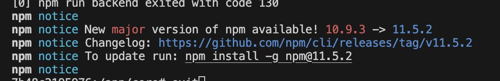

## Fastify_Vite_TS_Setup
Fastify, Vite, and TypeScript Setup

## Problem 1
The current profile page (`frontend/src/pages/profile.ts`) still uses **mocked numbers and static match history** in its HTML template.
While the backend already provides working API endpoints for user stats and match history, the frontend does not yet display this real data.

---

## Goals
1. **Replace all static profile stats** with data from:
	- `GET /api/users/:id/stats`
2. **Replace the static match history table** with data from:
	- `GET /api/users/:id/matches`
3. **Show opponent names** in the Match History table by requesting:
	- `GET /api/matches/:matchId/participants`

## Problem 2
Different languages. This module was not even started, so nothing to add here.

## Problem 3
2FA. Backend already implemented, but from the frontend perpective nothing yet.

## Problem 4
GDPR aka General Data Protection Regulation. Don't know anything about it.

## Problem 5
Game frontend.
1. Create buttons for the game and attach them to the game functions.
2. We will have 3 gamemodes:
	**Matchmaking**
	**Custom loby.**
	**Tornament.**

	We need to create a sequence on how user is entering a game.
	1. Go to the Game mode (might be changed to "Play").
	2. You selecting one of the game modes.
	3. When you open the game mode, you then selection options for that specific game mode.
		a. Map. Might be more, like speed, colors and so on.
	4. When you selected the options, you enter the match.
	Differences between gamemodes.
		- Matchmaking. 
			If somebody already created a loby whit the same options you selected, you will enter that loby.
			If there is no loby avaible with your options, the new loby will be created. Other peope who are searching for the game with the same options will automatically join your game loby.
			Also, you you can invite other people to join the loby.

		- Custom loby.
			With password. You create a loby and you create a password. Only people who knows the password, can join. You can also invite friends (or everybody, not sure yet) to this custom loby.
			Same as Machmaking, you can select options for the game, like MAP, speed and score maybe, time. Not avaire of full available options.
		
		- Tournament.
			Not sure about behavior of this. Tournament will be simmilar to custom lobby.
			There is a map selection of a sub set of all the maps (only 1v1 maps).
			After that the tournament is allready created and you can invite people the same way as to a lobby. Right now there is no UI for that part and it might be glitchy. At any point any participant of the tournament can start the tournament, after which no more people can be invited.

4. If you leave the gamemode page, you disconnect from the game.

5. Game invite should be using "/core/frontend/src/ui/gameInviteToast.ts".

3. Create/design end game screen. Then the game ends, what are we looking at?

## Problem 6
UPDATE EVERYTHING TO HTTPS/WSS

## Problem 7
Update NPM, so we dont see this warning anymore:

## Problem 8
Protecting backend endpoints? This what we talk about already before.

## Problem 9
Move the "All users" bubble to be visible only on Game Modes/Play page.
If we have better solution how to see all user list without leaving the gamemode page, I'm listening.

## Problem 10
Need to fully test the Live Chat/Live status/friend invites. If everything is updating live via ws correctly.

## Problem 11
1. Fix frontend menu, make texts bigger.
2. Change all the unicode emojies to SVG icons from core/frontend/src/ui/icons.ts
3. Add new info to footer. Developers Names, Lastnames, Linkedin (icon), Github (icon), might be something else.
4.

## Problem 12
Clean makefile, compose file, 

## Problem 13
All the console logs should be in english.

# Maksim Notes
- [x] Avatar insta update via ws for other users.
- [x] Main page text update from lorem ipsum.
- [x] When the game ends, its not possible to click logout button. Need to add z-index.
- [ ] Refactor CSS, have default styles from the styles.css. Make same sizes for different pages.
- [ ] Check how many modules we have. We have to have 7 major modules.
- [ ] Update game end page. Fix it a bit, add corners back so it feels better.
- [ ] Add notification on disconnect, when the player disconnects from the game.
- [ ] Prevent spam clicking invite to the game to all users. (localstorage and map)
- [ ] Fix mobile menu
- [x] Make all friends bubble scrollable
- [x] Update every page to use session instead of currentUser
