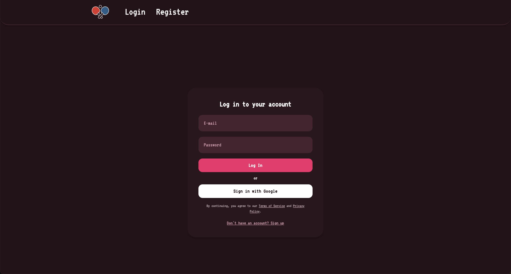
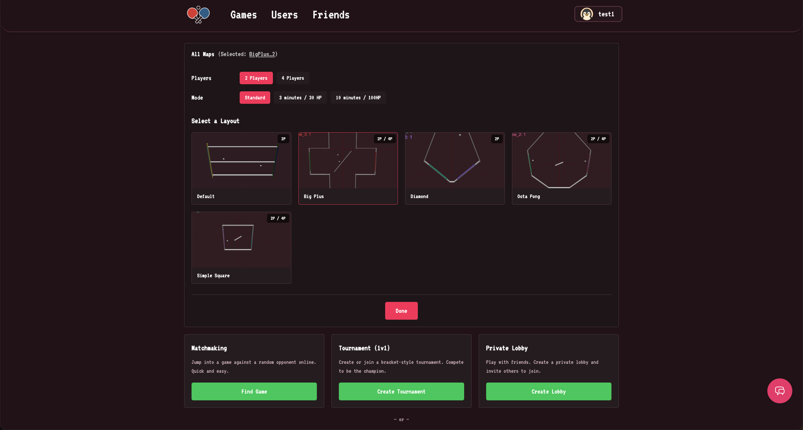
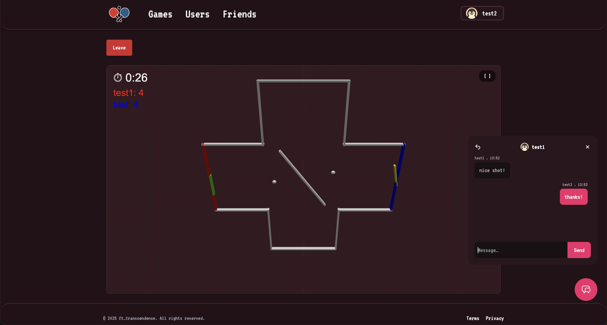
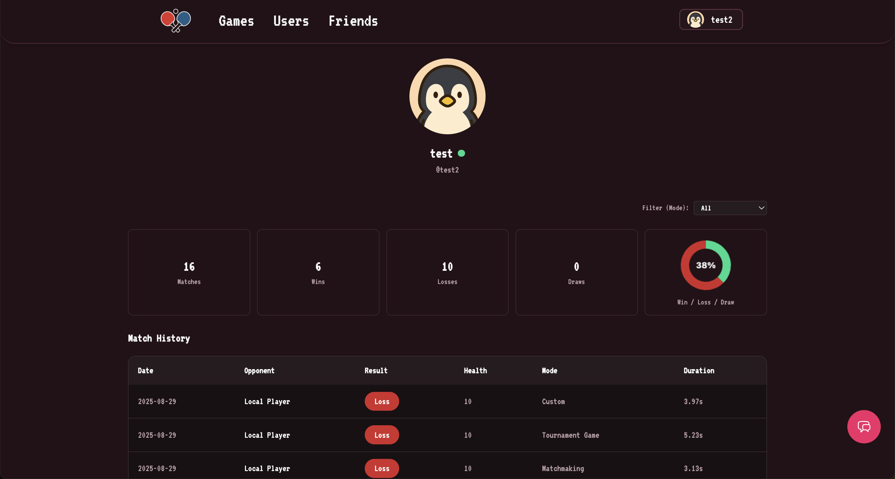
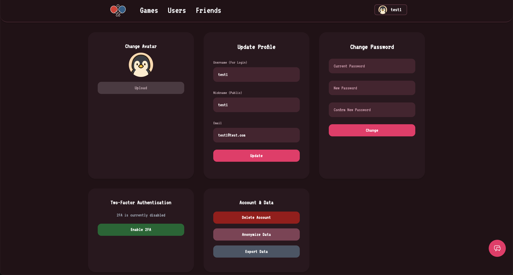

<div align="center">
  
  <h3 align="center">Transcendence</h3>
  
  Our final project of the 42 School core curriculum.
  
  
</div>

## 📚 Table of Contents

- [Project Overview](#-project-overview)
- [Screenshots](#-screenshots)
- [Tech Stack](#️-tech-stack)
- [Quick Start](#-quick-start)
- [Implemented Modules](#-implemented-modules)
- [Team](#-team)

## 🎯 Project Overview

Welcome to **ft_transcendence**! This is a full-stack web application featuring a real-time 3D Pong game with multiplayer capabilities, user management, chat functionality, tournaments, and much more.

### Key Features

- 🎮 **3D Pong Game** with Babylon.js
- 🌐 **Real-time Multiplayer** gaming
- 🏆 **Tournament System** with matchmaking
- 💬 **Live Chat** and messaging
- 👥 **User Management** with profiles and friends
- 🔐 **Security** with 2FA and OAuth
- 📱 **Compatibility** with all browsers
- 🚀 **Containerized** deployment with Docker

## 📸 Screenshots

<div align="center">
  <table>
    <tr>
      <td align="center">
        <br>
        <strong>🔐 Authentication</strong><br>
        <em>Secure login (Password or OAuth)</em>
      </td>
      <td align="center">
        <br>
        <strong>🎮 Game</strong><br>
        <em>Map selector & game modes</em>
      </td>
    </tr>
    <tr>
      <td align="center">
        <br>
        <strong>🏓 Live Gameplay</strong><br>
        <em>3D Pong with live chat</em>
      </td>
      <td align="center">
        <br>
        <strong>📊 User Profile</strong><br>
        <em>Stats & match history</em>
      </td>
    </tr>
    <tr>
      <td align="center" colspan="2">
        <br>
        <strong>⚙️ Settings & Privacy</strong><br>
        <em>Avatar upload, 2FA, GDPR features</em>
      </td>
    </tr>
  </table>
</div>

## 🛠️ Tech Stack

| Category | Technology |
|----------|------------|
| **Frontend** | TypeScript, Vite, Tailwind CSS, Babylon.js, SPA |
| **Backend** | Node.js, Fastify, SQLite |
| **Security** | JWT, OAuth 2.0, 2FA (TOTP), bcrypt, HTTPS, WSS |
| **Real-time** | WebSockets (ws library) |
| **Infrastructure** | Docker, Docker Compose, Caddy |

## 🚀 Quick Start

### Prerequisites
- Docker
- Docker Compose
- Make

### Environment Setup

1. **Clone the repository**
   ```bash
   git clone <repository-url>
   cd ft_transcendence
   ```

2. **Configure environment variables**
   ```bash
   cp .env.prod.example .env.prod
   # Edit .env.prod with your secrets (JWT_SECRET, COOKIE_SECRET, Google OAuth credentials)
   ```

3. **Generate secrets** (if needed)
   ```bash
   # JWT Secret (64 characters)
   openssl rand -hex 32
   
   # Cookie Secret (32 characters)
   openssl rand -hex 16
   ```

### 🎮 Running the Application

#### Production Mode
```bash
# Start the application
make prod-up

# View logs
make prod-logs

# Stop the application
make prod-down

# Alternatively: restart the application
make prod-re
```

#### Development Mode
```bash
# Start development environment
make dev

# Clean up development containers
make clean
```

#### Utility Commands
```bash
# Complete Docker cleanup
make ff_clean_docker

# Update environment variables
make update-env
```

#### Project Structure
```
ft_transcendence/
├── core/
│   ├── frontend/          # Vite + TypeScript frontend
│   ├── backend/           # Fastify + Node.js backend
│   └── game_shared/       # Shared game logic
├── docker/                # Docker configurations
└── docker-compose.yml     # Container orchestration
```

### 🌐 Access the Application

- **Production**: `https://localhost:443` or `https://<your-hostname>:1443`
- **Development**: `http://localhost:5173` (Frontend) + `http://localhost:3000` (Backend)

## 🎯 Implemented Modules

This project fulfilled all mandatory requirements and includes multiple bonus modules from the subject.

**Final Score: 125/100** 🎉

### Web Development
- ✅ **Frontend Framework**: TypeScript
- ✅ **Single Page Application**: Complete SPA architecture
- ✅ **Browser Compatibility**: Firefox, Chrome, Brave
- ✅ **Containerization**: Docker deployment with single command

### Game Features
- ✅ **Live Multiplayer Pong**: Real-time gameplay
- ✅ **Local & Remote Play**: Same keyboard or different players
- ✅ **Tournament System**: Multi-player tournaments with matchmaking
- ✅ **Server-Side Game Logic**: Anti-cheat protection
- ✅ **3D Graphics**: Immersive Babylon.js rendering with camera controls
- ✅ **Game Customization**: Adjustable game parameters

### User Management
- ✅ **Secure Authentication**: Hashed passwords with strong algorithms
- ✅ **OAuth Integration**: Google Sign-In support
- ✅ **User Profiles**: Custom avatars, usernames, display names
- ✅ **Statistics Tracking**: Win/loss records and match history
- ✅ **Two-Factor Authentication**: Enhanced security with 2FA
- ✅ **GDPR Compliance**: Data export, anonymization, and deletion

### Social Features
- ✅ **Real-time Chat**: Direct messaging between users
- ✅ **Friends System**: Add friends and view online status
- ✅ **User Blocking**: Block unwanted interactions
- ✅ **Game Invitations**: Invite friends to matches

### Security & Infrastructure
- ✅ **HTTPS/WSS**: End-to-end encryption
- ✅ **Input Validation**: Frontend and backend validation
- ✅ **Protected Routes**: Secure access control
- ✅ **CSRF Protection**: Cross-site request forgery prevention

## 👥 Team

| Name | Role | Profile |
|------|------|---------|
| **Fabian Rapp** | Game | <a href="https://www.linkedin.com/in/-fabian-rapp">LinkedIn</a> |
| **Iliès Ziane** | Backend | <a href="https://www.linkedin.com/in/ilies-ziane-19703a23a/">LinkedIn</a> |
| **Maksim Volkmann** | Frontend | <a href="https://www.linkedin.com/in/maksim-volkmann-93165383/">LinkedIn</a> |
| **Daniel Ilin** | Frontend | <a href="https://www.linkedin.com/in/ilindaniel/">LinkedIn</a> \| <a href="https://ilindaniel.com/">Website</a> |
